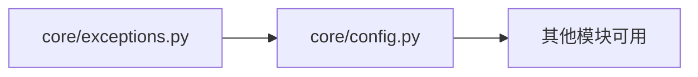
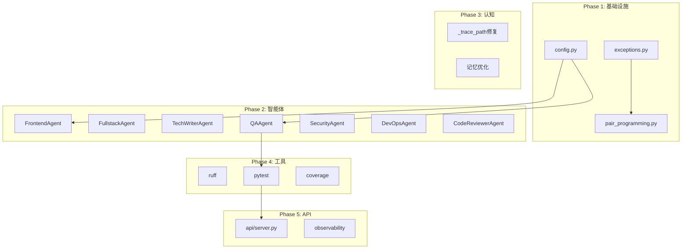

# Chairman Agents 系统实现工作流

> 生成时间: 2025-12-23
> 深度: DEEP | 策略: PARALLEL | 模式: ULTRATHINK

---

## 系统概览

```
┌─────────────────────────────────────────────────────────────────────────────┐
│                    主席级智能体团队系统 (Chairman Agents)                      │
├─────────────────────────────────────────────────────────────────────────────┤
│  模块: core/ | cognitive/ | agents/ | collaboration/ | orchestration/       │
│  角色: 18种专家角色 | 能力: 35种细分能力                                       │
│  协作: 辩论/共识/结对编程 | 工作流: 6阶段标准流程                              │
└─────────────────────────────────────────────────────────────────────────────┘
```

---

## Phase 1: 基础设施修复 (Critical Path)

### 1.1 核心模块补全 [P0 - 阻塞性]



| 任务ID | 任务名称 | 优先级 | 估算 | 依赖 | 并行组 |
|--------|----------|--------|------|------|--------|
| T1.1.1 | 创建 core/exceptions.py | P0 | 1h | - | G1 |
| T1.1.2 | 创建 core/config.py | P0 | 2h | - | G1 |
| T1.1.3 | 创建 core/__init__.py 导出 | P0 | 0.5h | T1.1.1, T1.1.2 | G2 |

#### T1.1.1 - core/exceptions.py 详细规格

```python
# 需要实现的异常类层次:
ChairmanAgentError (Base)
├── LLMError
│   ├── LLMRateLimitError
│   ├── LLMTimeoutError
│   └── LLMResponseError
├── AgentError
│   ├── TaskExecutionError
│   ├── AgentNotFoundError
│   └── CapabilityMismatchError
├── WorkflowError
│   ├── QualityGateError
│   ├── PhaseTransitionError
│   └── DependencyError
├── ToolError
│   ├── ToolExecutionError
│   └── ToolTimeoutError
└── ConfigurationError
```

#### T1.1.2 - core/config.py 详细规格

```python
# 需要实现的配置结构:
@dataclass
class Config:
    # LLM配置
    llm: LLMConfig

    # 团队配置
    team: TeamConfig

    # 编排配置
    orchestrator: OrchestratorConfig

    # 质量配置
    quality: QualityConfig

    # 路径配置
    paths: PathConfig

    @classmethod
    def from_yaml(cls, path: Path) -> Config

    @classmethod
    def from_env(cls) -> Config
```

---

### 1.2 协作模块补全 [P0]

| 任务ID | 任务名称 | 优先级 | 估算 | 依赖 | 并行组 |
|--------|----------|--------|------|------|--------|
| T1.2.1 | 创建 collaboration/pair_programming.py | P0 | 4h | T1.1.1 | G3 |
| T1.2.2 | 修复 collaboration/debate.py 解析逻辑 | P1 | 2h | - | G1 |
| T1.2.3 | 修复 collaboration/consensus.py | P1 | 2h | - | G1 |

#### T1.2.1 - pair_programming.py 详细规格

```python
# 需要实现的核心类:
@dataclass
class PairSession:
    id: str
    driver: AgentId        # 当前编码者
    navigator: AgentId     # 当前审查者
    task: Task
    artifacts: list[Artifact]

class PairProgrammingSystem:
    async def start_session(driver, navigator, task) -> PairSession
    async def switch_roles(session: PairSession) -> None
    async def suggest(session, suggestion: str) -> None
    async def end_session(session) -> PairResult
```

---

## Phase 2: 智能体实现补全 (Parallel Execution)

### 2.1 专业智能体实现 [P1 - 可并行]

```
┌────────────────────────────────────────────────────────────────────────────┐
│                           并行执行组                                         │
├────────────────────────────────────────────────────────────────────────────┤
│                                                                             │
│  [G4] ─┬─ FrontendEngineerAgent ──────┬─────────────────────────┐          │
│        ├─ FullstackEngineerAgent      │                         │          │
│        └─ TechWriterAgent             │  独立实现               │          │
│                                       ▼                         ▼          │
│  [G5] ─┬─ QAEngineerAgent ───────────┬─────────────────────────┐          │
│        ├─ SecurityArchitectAgent     │                         │          │
│        └─ DevOpsEngineerAgent        │  独立实现               │          │
│                                       ▼                         ▼          │
│  [G6] ─── CodeReviewerAgent ──────────────────────────────────────          │
│                                                                             │
└────────────────────────────────────────────────────────────────────────────┘
```

| 任务ID | 智能体 | 核心能力 | 估算 | 并行组 |
|--------|--------|----------|------|--------|
| T2.1.1 | FrontendEngineerAgent | UI组件生成、样式处理 | 4h | G4 |
| T2.1.2 | FullstackEngineerAgent | 端到端功能实现 | 4h | G4 |
| T2.1.3 | TechWriterAgent | 文档生成、API文档 | 3h | G4 |
| T2.1.4 | QAEngineerAgent | 测试用例生成、自动化测试 | 4h | G5 |
| T2.1.5 | SecurityArchitectAgent | 安全审计、漏洞分析 | 4h | G5 |
| T2.1.6 | DevOpsEngineerAgent | CI/CD配置、容器化 | 4h | G5 |
| T2.1.7 | CodeReviewerAgent | 代码审查、最佳实践 | 3h | G6 |

#### 智能体实现模板

```python
class XxxAgent(BaseAgent):
    """[角色名]智能体."""

    async def _execute_step(
        self,
        step: dict[str, Any],
        task: Task,
        context: TaskContext,
    ) -> dict[str, Any]:
        """执行步骤 - 必须实现."""
        action = step.get("action", "")

        # 根据action类型分发到具体方法
        if "xxx" in action:
            return await self._do_xxx(task, context)
        # ... 其他action处理

        return {"result": "步骤完成"}

    async def _generate_final_output(
        self,
        task: Task,
        context: TaskContext,
        plan: list[dict[str, Any]],
        intermediate_artifacts: list[Artifact],
    ) -> Artifact | None:
        """生成最终输出 - 必须实现."""
        # 根据task.type生成对应产出物
        pass
```

---

## Phase 3: 认知系统修复 (Sequential)

### 3.1 推理引擎修复 [P1]

| 任务ID | 任务名称 | 优先级 | 估算 | 依赖 |
|--------|----------|--------|------|------|
| T3.1.1 | 修复 _trace_path 方法 | P1 | 2h | - |
| T3.1.2 | 实现节点索引维护 | P1 | 1h | T3.1.1 |
| T3.1.3 | 添加单元测试 | P2 | 1h | T3.1.2 |

#### T3.1.1 - _trace_path 修复方案

```python
def _trace_path(
    self,
    node: ThoughtNode,
    root: ThoughtNode,
    node_index: dict[str, ThoughtNode],
) -> list[ThoughtNode]:
    """追溯从根到节点的路径 - 修复版."""
    path = []
    current = node

    while current is not None:
        path.append(current)
        if current.id == root.id:
            break
        # 通过parent_id查找父节点
        parent_id = current.parent_id
        current = node_index.get(parent_id) if parent_id else None

    return list(reversed(path))
```

### 3.2 记忆系统优化 [P2]

| 任务ID | 任务名称 | 优先级 | 估算 | 依赖 |
|--------|----------|--------|------|------|
| T3.2.1 | 改进相关性计算（支持中文） | P2 | 3h | - |
| T3.2.2 | 添加向量嵌入支持（可选） | P3 | 4h | T3.2.1 |

---

## Phase 4: 工具集成 (Parallel)

### 4.1 真实工具集成 [P1]

```
┌────────────────────────────────────────────────────────────────────────────┐
│                          工具集成矩阵                                        │
├────────────────────────────────────────────────────────────────────────────┤
│  工具类型          │ 当前状态    │ 目标实现                                   │
├────────────────────────────────────────────────────────────────────────────┤
│  Linter (ruff)    │ 假实现      │ 真正调用 ruff check                        │
│  Test (pytest)    │ 假实现      │ 真正调用 pytest                            │
│  Coverage         │ 硬编码      │ 真正收集覆盖率                              │
│  Type Check       │ 缺失        │ 集成 mypy                                  │
│  Security Scan    │ 缺失        │ 集成 bandit                                │
└────────────────────────────────────────────────────────────────────────────┘
```

| 任务ID | 任务名称 | 优先级 | 估算 | 并行组 |
|--------|----------|--------|------|--------|
| T4.1.1 | 集成 ruff linter | P1 | 2h | G7 |
| T4.1.2 | 集成 pytest runner | P1 | 2h | G7 |
| T4.1.3 | 集成 coverage 收集 | P1 | 2h | G7 |
| T4.1.4 | 集成 mypy 类型检查 | P2 | 2h | G8 |
| T4.1.5 | 集成 bandit 安全扫描 | P2 | 2h | G8 |

---

## Phase 5: API与可观测性 (Sequential)

### 5.1 API服务实现 [P2]

| 任务ID | 任务名称 | 优先级 | 估算 | 依赖 |
|--------|----------|--------|------|------|
| T5.1.1 | 创建 api/server.py (FastAPI) | P2 | 4h | Phase 1-4 |
| T5.1.2 | 实现 REST API 端点 | P2 | 3h | T5.1.1 |
| T5.1.3 | 添加 WebSocket 支持 | P3 | 3h | T5.1.2 |

### 5.2 可观测性模块 [P2]

| 任务ID | 任务名称 | 优先级 | 估算 | 依赖 |
|--------|----------|--------|------|------|
| T5.2.1 | 创建 observability/metrics.py | P2 | 2h | - |
| T5.2.2 | 创建 observability/tracing.py | P2 | 3h | - |
| T5.2.3 | 集成 OpenTelemetry | P3 | 4h | T5.2.1, T5.2.2 |

---

## 依赖关系图



---

## 并行执行计划

```
时间线 ──────────────────────────────────────────────────────────────────────►

批次1 (并行)
├── [T1.1.1] exceptions.py ████████
├── [T1.1.2] config.py     ████████████████
├── [T1.2.2] debate.py修复  ████████████
└── [T1.2.3] consensus修复  ████████████

批次2 (并行 - 依赖批次1)
├── [T1.2.1] pair_programming.py ████████████████████
├── [T3.1.1] _trace_path修复      ████████████
└── [T3.2.1] 记忆系统优化          ████████████████

批次3 (并行)
├── [T2.1.1] FrontendAgent     ████████████████████
├── [T2.1.2] FullstackAgent    ████████████████████
├── [T2.1.3] TechWriterAgent   ████████████████
├── [T2.1.4] QAAgent           ████████████████████
├── [T2.1.5] SecurityAgent     ████████████████████
├── [T2.1.6] DevOpsAgent       ████████████████████
└── [T2.1.7] CodeReviewerAgent ████████████████

批次4 (并行)
├── [T4.1.1] ruff集成      ████████████
├── [T4.1.2] pytest集成    ████████████
├── [T4.1.3] coverage集成  ████████████
├── [T4.1.4] mypy集成      ████████████
└── [T4.1.5] bandit集成    ████████████

批次5 (顺序)
├── [T5.1.1] api/server.py ────────────████████████████████
├── [T5.1.2] REST API      ─────────────────────████████████████
└── [T5.2.*] observability ─────────────────────────────████████████████
```

---

## 质量门禁

### 每个任务必须满足:

| 门禁 | 标准 | 检查方式 |
|------|------|----------|
| Lint | ruff check 通过 | `ruff check .` |
| Type | mypy 无错误 | `mypy .` |
| Test | 测试覆盖率 ≥ 80% | `pytest --cov` |
| Doc | 所有公开API有文档 | docstring检查 |

### Phase门禁:

- **Phase 1完成**: 所有基础模块可导入，无循环依赖
- **Phase 2完成**: 所有智能体可实例化并执行简单任务
- **Phase 3完成**: 推理引擎单元测试全部通过
- **Phase 4完成**: 工具集成端到端测试通过
- **Phase 5完成**: API可访问，健康检查通过

---

## 风险与缓解

| 风险 | 可能性 | 影响 | 缓解策略 |
|------|--------|------|----------|
| LLM API不稳定 | 中 | 高 | 添加重试机制和fallback |
| 智能体实现复杂度超预期 | 中 | 中 | 分批实现，先简后复杂 |
| 工具集成兼容性问题 | 低 | 中 | 使用Docker标准化环境 |
| 中文处理问题 | 中 | 中 | 引入jieba分词 |

---

## 执行命令

### 启动并行开发:

```bash
# 批次1 - 基础设施
claude task "实现 core/exceptions.py" --background &
claude task "实现 core/config.py" --background &
claude task "修复 debate.py 解析" --background &
wait

# 批次2 - 协作与认知
claude task "实现 pair_programming.py" --background &
claude task "修复 _trace_path" --background &
wait

# 批次3 - 智能体 (全并行)
for agent in Frontend Fullstack TechWriter QA Security DevOps CodeReviewer; do
    claude task "实现 ${agent}Agent" --background &
done
wait
```

---

## 验收标准

```
✅ 所有缺失模块已创建
✅ 所有智能体 _execute_step 有真实实现
✅ 所有工具集成真实调用外部工具
✅ 单元测试覆盖率 ≥ 80%
✅ 类型检查无错误
✅ API服务可访问
✅ 文档完整
```

---

*工作流由 /sc:workflow --depth deep --parallel 生成*
