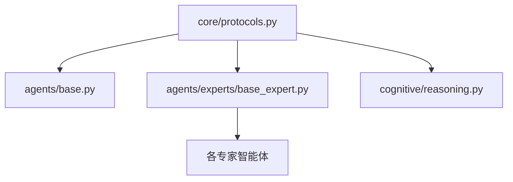
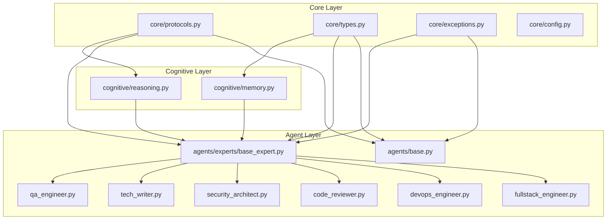

# Chairman Agents 模块分解方案

**创建时间**: 2025-12-23
**目的**: 修复 P0/P1 技术债务，建立清晰的模块边界和接口契约

---

## 问题总结

### 已识别问题

| 优先级 | 问题 | 影响范围 | 估计工作量 |
|--------|------|----------|------------|
| P0 | LLMClientProtocol 重复定义 7 次 | 7 个文件 | 2h |
| P0 | BaseExpertAgent 重复定义 7 次 | 7 个文件 | 2h |
| P0 | 16+ mypy 类型错误 | 6 个文件 | 3h |
| P1 | MemorySystem 接口不一致 | 3 个文件 | 2h |
| P1 | ConfigurationError 导入冲突 | 1 个文件 | 0.5h |

---

## 模块分解架构

```
chairman_agents/
├── core/                      # [模块 A] 核心协议层
│   ├── protocols.py           # 统一协议定义 (已存在，需完善)
│   ├── types.py               # 类型定义 (已存在)
│   ├── exceptions.py          # 异常定义 (已存在)
│   ├── config.py              # 配置管理 (已存在)
│   └── __init__.py            # 模块导出 (需修复冲突)
│
├── cognitive/                 # [模块 B] 认知系统层
│   ├── memory.py              # 记忆系统 (需修复接口)
│   └── reasoning.py           # 推理引擎 (需移除重复定义)
│
├── agents/                    # [模块 C] 智能体层
│   ├── base.py                # 基础智能体 (需重构为导入协议)
│   └── experts/               # 专家智能体
│       ├── base_expert.py     # 专家基类 (需重构)
│       ├── fullstack_engineer.py
│       ├── devops_engineer.py
│       ├── qa_engineer.py
│       ├── code_reviewer.py
│       ├── security_architect.py
│       ├── tech_writer.py
│       └── frontend_engineer.py
│
└── collaboration/             # 协作层 (暂不涉及)
```

---

## 模块 A: 协议统一

### 目标
将所有重复的协议定义统一到 `core/protocols.py`

### 当前状态

**LLMClientProtocol 重复位置**:
| 文件 | 行号 | 状态 |
|------|------|------|
| `core/protocols.py` | 40 | **权威定义** |
| `agents/base.py` | 81 | 待移除 |
| `agents/experts/base_expert.py` | 61 | 待移除 |
| `cognitive/reasoning.py` | 42 | 待移除 |
| `agents/experts/fullstack_engineer.py` | 675 | 待移除 |
| `agents/experts/code_reviewer.py` | 496 | 待移除 |
| `agents/experts/security_architect.py` | 47 | 待移除 |
| `agents/experts/tech_writer.py` | 50 | 待移除 |

**BaseExpertAgent 重复位置**:
| 文件 | 行号 | 状态 |
|------|------|------|
| `agents/experts/base_expert.py` | 132 | **权威定义** |
| `agents/base.py` | 443 | 待移除/合并 |
| `agents/experts/devops_engineer.py` | 633 | 待移除 |
| `agents/experts/fullstack_engineer.py` | 695 | 待移除 |
| `agents/experts/code_reviewer.py` | 509 | 待移除 |
| `agents/experts/security_architect.py` | 255 | 待移除 |
| `agents/experts/tech_writer.py` | 360 | 待移除 |

### 接口契约

```python
# core/protocols.py - 权威协议定义

@runtime_checkable
class LLMClientProtocol(Protocol):
    """LLM 客户端协议 - 所有 LLM 客户端必须实现."""

    async def generate(
        self,
        prompt: str,
        *,
        temperature: float = 0.7,
        max_tokens: int = 2048,
    ) -> str: ...

    async def complete(
        self,
        prompt: str,
        *,
        temperature: float = 0.7,
        max_tokens: int = 4096,
    ) -> str: ...


@runtime_checkable
class ToolExecutorProtocol(Protocol):
    """工具执行器协议."""

    async def execute(
        self,
        tool_type: ToolType,
        params: dict[str, Any],
    ) -> dict[str, Any]: ...


@runtime_checkable
class MessageBrokerProtocol(Protocol):
    """消息代理协议."""

    async def send_message(self, message: AgentMessage) -> None: ...
    async def receive_messages(...) -> list[AgentMessage]: ...
    async def broadcast(...) -> None: ...


@runtime_checkable
class AgentRegistryProtocol(Protocol):
    """智能体注册表协议."""

    def find_agents_by_capability(...) -> list[AgentId]: ...
    def find_agents_by_role(...) -> list[AgentId]: ...
    def get_agent_profile(...) -> AgentProfile | None: ...
```

### 修复步骤

1. **确认 `core/protocols.py` 包含所有需要的协议** (已完成)
2. **修改 `agents/base.py`**:
   - 删除 L81-L104 的 `LLMClientProtocol` 定义
   - 删除 L107-L175 的其他协议定义
   - 添加: `from chairman_agents.core.protocols import LLMClientProtocol, ToolExecutorProtocol, MessageBrokerProtocol, AgentRegistryProtocol`
3. **修改 `agents/experts/base_expert.py`**:
   - 删除 L60-L84 的 `LLMClientProtocol` 定义
   - 添加: `from ...core.protocols import LLMClientProtocol`
4. **修改 `cognitive/reasoning.py`**:
   - 删除 L42 附近的 `LLMClientProtocol` 定义
   - 添加: `from chairman_agents.core.protocols import LLMClientProtocol`
5. **修改各专家智能体文件**:
   - `fullstack_engineer.py`: 删除 L675, L695 的重复定义
   - `code_reviewer.py`: 删除 L496, L509 的重复定义
   - `security_architect.py`: 删除 L47, L255 的重复定义
   - `tech_writer.py`: 删除 L50, L360 的重复定义
   - `devops_engineer.py`: 删除 L633 的重复定义

### 依赖关系



---

## 模块 B: 类型错误修复

### 目标
修复所有 mypy 类型错误

### 错误清单

| 文件 | 行号 | 问题 | 修复方案 |
|------|------|------|----------|
| `memory.py` | 180, 258 | 缺少类型注解 | 添加类型注解 |
| `qa_engineer.py` | 1399 | None 赋值给 str | 使用 `Optional[str]` 或默认值 |
| `core/__init__.py` | 62, 67 | ConfigurationError 导入冲突 | 重命名其中一个导入 |
| `fullstack_engineer.py` | 816 | MemorySystem.add 不存在 | 改为 MemorySystem.store |
| `fullstack_engineer.py` | 835 | MemorySystem.search 不存在 | 改为 MemorySystem.retrieve |
| `fullstack_engineer.py` | 954, 967, 968 | 类型不匹配 | 添加类型转换或修复类型 |
| `devops_engineer.py` | 312, 328, 330 | 类型不兼容 | 修复类型定义 |
| `base_expert.py` | 366, 367 | retrieve 签名不匹配 | 修复调用方式 |

### 关键修复

#### 1. ConfigurationError 导入冲突

**当前代码** (`core/__init__.py`):
```python
from .exceptions import (
    ConfigurationError,  # L62
    ...
)

from .config import (
    ConfigurationError,  # L67 - 重复！
    ...
)
```

**修复方案**:
```python
from .exceptions import (
    ConfigurationError,
    ...
)

from .config import (
    ConfigurationError as ConfigError,  # 重命名避免冲突
    ...
)
```

#### 2. MemorySystem 接口不一致

**问题**: `fullstack_engineer.py` 调用不存在的方法

| 调用 | 应改为 |
|------|--------|
| `self._memory.add(content, memory_type=...)` | `self._memory.store(content, memory_type, ...)` |
| `self._memory.search(query, limit=...)` | `self._memory.retrieve(MemoryQuery(...))` |

**修复代码**:
```python
# Before (fullstack_engineer.py:816)
self._memory.add(content, memory_type=memory_type)

# After
self._memory.store(content, memory_type=memory_type)

# Before (fullstack_engineer.py:835)
results = self._memory.search(query, limit=limit)

# After
from chairman_agents.cognitive.memory import MemoryQuery
query_obj = MemoryQuery(query=query, limit=limit)
results = self._memory.retrieve(query_obj)
return [item.content for item, _score in results]
```

#### 3. base_expert.py retrieve 签名不匹配

**当前代码** (base_expert.py:366-367):
```python
memories = await self._memory_system.retrieve(
    query=f"{task.title} {task.description}",
    limit=10,
)
```

**问题**: `MemorySystem.retrieve` 接受 `MemoryQuery` 对象，不是关键字参数

**修复方案**:
```python
from ...cognitive.memory import MemoryQuery

query = MemoryQuery(
    query=f"{task.title} {task.description}",
    limit=10,
)
results = self._memory_system.retrieve(query)
memories = [item for item, _score in results]
```

**或者**: 在 MemorySystem 中添加兼容方法 (推荐):
```python
# memory.py 添加便捷方法
def search(
    self,
    query: str,
    limit: int = 10,
    memory_types: list[str] | None = None,
) -> list[MemoryItem]:
    """便捷搜索方法，返回 MemoryItem 列表."""
    query_obj = MemoryQuery(query=query, limit=limit, memory_types=memory_types)
    results = self.retrieve(query_obj)
    return [item for item, _score in results]
```

---

## 模块 C: 接口一致性

### 目标
统一 MemorySystem 接口，确保所有调用方使用一致的签名

### MemorySystem 接口契约

```python
class MemorySystem:
    """记忆系统 - 统一接口定义."""

    # 存储方法
    def store(
        self,
        content: str,
        memory_type: str,
        importance: float = 0.5,
        metadata: dict[str, Any] | None = None,
    ) -> MemoryItem: ...

    # 检索方法 (主要)
    def retrieve(
        self,
        query: MemoryQuery,
    ) -> list[tuple[MemoryItem, float]]: ...

    # 便捷搜索方法 (新增)
    def search(
        self,
        query: str,
        limit: int = 10,
        memory_types: list[str] | None = None,
    ) -> list[MemoryItem]: ...

    # 按类型检索
    def retrieve_by_type(
        self,
        memory_type: str,
        limit: int = 10,
    ) -> list[MemoryItem]: ...
```

### 调用方修复清单

| 文件 | 当前调用 | 修复为 |
|------|----------|--------|
| `agents/base.py:1064` | `retrieve(memory_query)` | 保持不变 (正确) |
| `base_expert.py:366` | `await retrieve(query=..., limit=...)` | `search(query, limit)` |
| `fullstack_engineer.py:816` | `add(...)` | `store(...)` |
| `fullstack_engineer.py:835` | `search(...)` | `search(...)` (需添加方法) |

---

## 执行计划

### 阶段 1: 协议统一 (模块 A)
**预计时间**: 2h
**依赖**: 无

```
任务 A1: 确认 core/protocols.py 完整性
任务 A2: 修改 agents/base.py，删除重复定义，添加导入
任务 A3: 修改 agents/experts/base_expert.py
任务 A4: 修改 cognitive/reasoning.py
任务 A5: 修改 fullstack_engineer.py
任务 A6: 修改 code_reviewer.py
任务 A7: 修改 security_architect.py
任务 A8: 修改 tech_writer.py
任务 A9: 修改 devops_engineer.py
```

### 阶段 2: MemorySystem 接口统一 (模块 C)
**预计时间**: 2h
**依赖**: 无

```
任务 C1: 在 memory.py 添加 search() 便捷方法
任务 C2: 修复 base_expert.py 的 retrieve 调用
任务 C3: 修复 fullstack_engineer.py 的接口调用
```

### 阶段 3: 类型错误修复 (模块 B)
**预计时间**: 3h
**依赖**: 模块 A, 模块 C

```
任务 B1: 修复 core/__init__.py ConfigurationError 冲突
任务 B2: 修复 memory.py 类型注解
任务 B3: 修复 qa_engineer.py None 赋值
任务 B4: 修复 devops_engineer.py 类型不兼容
任务 B5: 修复 fullstack_engineer.py 剩余类型错误
任务 B6: 运行 mypy 验证所有错误已修复
```

### 阶段 4: 验证
**预计时间**: 1h

```
任务 V1: 运行 mypy --strict 验证
任务 V2: 运行单元测试
任务 V3: 运行集成测试
```

---

## 风险与缓解

| 风险 | 影响 | 缓解措施 |
|------|------|----------|
| 删除重复定义导致导入失败 | 高 | 每个文件修改后立即运行导入测试 |
| MemorySystem 接口变更影响现有功能 | 中 | 添加便捷方法而非修改现有方法签名 |
| BaseExpertAgent 合并导致功能丢失 | 高 | 仔细对比两个定义，保留所有功能 |

---

## 验收标准

1. [ ] `mypy chairman_agents/ --ignore-missing-imports` 返回 0 错误
2. [ ] `LLMClientProtocol` 仅在 `core/protocols.py` 定义
3. [ ] `BaseExpertAgent` 仅在 `agents/experts/base_expert.py` 定义
4. [ ] 所有 MemorySystem 调用使用一致的接口
5. [ ] `core/__init__.py` 无导入冲突
6. [ ] 所有现有测试通过

---

## 文件变更摘要

| 文件 | 变更类型 | 变更内容 |
|------|----------|----------|
| `core/protocols.py` | 保持 | 权威协议定义 |
| `core/__init__.py` | 修改 | 修复 ConfigurationError 冲突 |
| `cognitive/memory.py` | 修改 | 添加 search() 便捷方法 |
| `cognitive/reasoning.py` | 修改 | 删除重复协议，添加导入 |
| `agents/base.py` | 修改 | 删除重复协议，添加导入 |
| `agents/experts/base_expert.py` | 修改 | 删除重复协议，修复 retrieve 调用 |
| `agents/experts/fullstack_engineer.py` | 修改 | 删除重复定义，修复接口调用 |
| `agents/experts/devops_engineer.py` | 修改 | 删除重复定义，修复类型 |
| `agents/experts/code_reviewer.py` | 修改 | 删除重复定义 |
| `agents/experts/security_architect.py` | 修改 | 删除重复定义 |
| `agents/experts/tech_writer.py` | 修改 | 删除重复定义 |
| `agents/experts/qa_engineer.py` | 修改 | 修复 None 赋值 |

---

## 附录: 完整依赖图



---

**文档版本**: 1.0
**最后更新**: 2025-12-23
